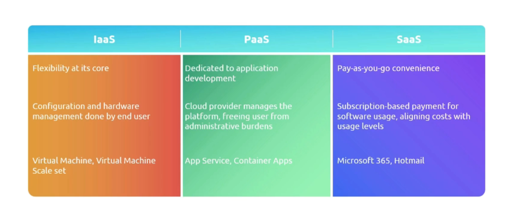

# 1.6 Cloud Services Types

1. Infrastructure as a Service (IaaS)
2. Platform as a Service (PaaS)
3. Software as a Service(SaaS)

### Infrastructure as a Service (IaaS):

- IaaS provides us with the raw infrastructure on cloud such as servers, storage, network. Gives us complete control over environment.
- We are responsible for managing everything from OS to applications.
- Provider is responsible only for providing the infrastructure such as network, firewall, security and own the hardwares.
- Flexible Option - Clients can rent the servers from the providers.
- Scalability Benefits - Allocate resources depending on the need or demand.
- Reliable cloud features - disaster recovery, uptime assurance.
- Just choose os, install softwares and services, end users get to use it.

### Platform as a Service (PaaS):

- It’s like moving into pre furnished apartment. The necessary infrastructure is already available, we focus on deployment and management of the application.
- PaaS is built over IaaS, i.e. it has necessary infrastructure pre furnished such as servers and storage, Networking and firewalls, datacenters, PaaS also adds OS, DevOPs, DB management, analytical tools.
- Focused on application developer context, relieves management of infrastructure.

### Software as a Service (SaaS):

- It’s like a streaming service, we just need internet to access the software.
- Software is hosted and managed by the service provider.
- This reduces the efforts and software maintenance and infrastructure management.
- Reliance on external software that may not meet the need.
- SaaS is built over IaaS and PaaS, i.e. it has necessary infrastructure and OSes, tools and DB along with the custom softwares.

