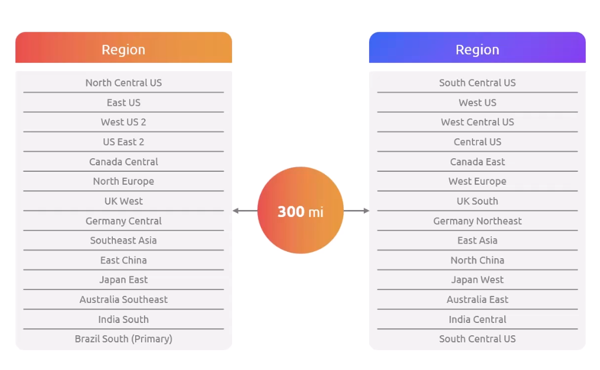

# 2.1 Regions and Availability Zones

### Regions:

- Regions are clusters of datacenters interlinked with each other through a low latency network.
- This ensures high scalability and flexibility. And allows effective disaster recovery strategy.
- 60 + regions, 140 countries available.
- The key aspect of regions is to uphold data residency requirements and user proximity to comply with local regulations and to provide a better performance.
- We should consider region availability for deployment, because not all regions have all features.
- Some services are independent of the regions.

### Availability Zones:

- Availability zones are introduced to tackle the problem of data residency.

> Data residency refers to the physical or geographical location of an organization’s data or information. There are data residency laws that require the data about a nation’s citizen to be collected and stored within a country.
> 
- Availability zones are encompassed inside the azure regions as independent datacenters.
- These ensure operation continuity even during unforeseen disruptions.
- Helps mitigating downtime, the zones are separated from each other so that they are immune to shared vulnerabilities, they have robust connectivity.
- They are independent with their own power, cooling and networks.

### Disaster Recovery:

- Disaster recovery is ensured by Azure regional pairs.
- Data residency boundaries, if one region goes down completely, including the availability zones, we can switch to secondary region(disaster recovery region).

### Regional Pairs:

- Automated Replication, Azure implements automated replication for certain services. This means that the data is automatically duplicated across pair regions. Geo-redundant data.
- Prioritized Recovery, this ensures that at least one region in each pair is brought back online to provide seamless service continuity.
- Sequential Updates, The updates are extremely planned and executed, so that the updates are sequential among regional pairs rather than simultaneously, ensuring minimal disruption, also preventing attacks caused due to new update.

### Sovereign Regions:

- Specialized azure regions that are tailored to meet unique requirements for security, compliance, and privacy of specific government entities.
- Azure Government, The dedicated instance of Azure designed to meet the stringent security and compliant requirement of the US federal government also local government. Separately operated from non-governmental deployments(both physically and logically), to ensure higher level of protection. Authorized Personnel Only access.
- Azure China, independent instance of azure, partnered with 21vianet, this ensures that the services are isolated physically. All data is kept inside China only fulfilling the legal requirements.

# DATACENTRE MAP

[https://datacenters.microsoft.com/globe/explore/](https://datacenters.microsoft.com/globe/explore/)