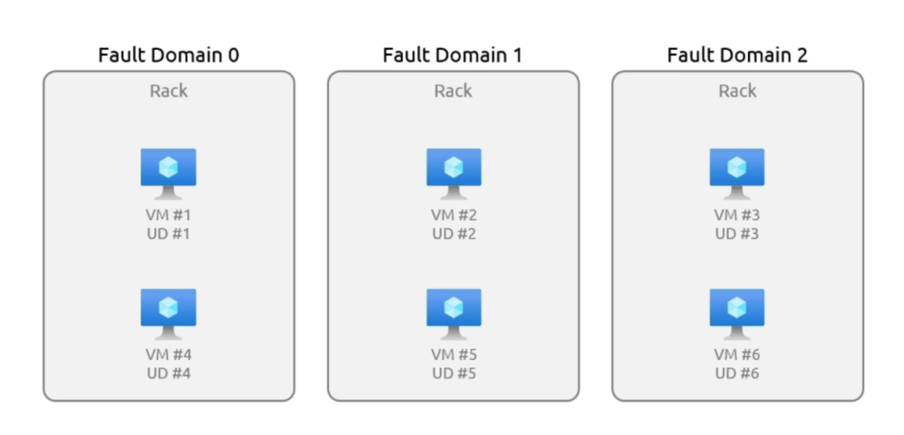

# 3.1.1 Virtual Machines and Virtual Machine Scale Sets

# Virtual Machines[VMs]

Virtual machines are a software emulation of a physical computer that runs an operating system and applications.

### Features of Azure VM:

- Variety of sizes to cater different needs.
- Highly customizable depending on our needs.
- Integrated Support with other Azure services such as Entra ID, Storage services and DB.

### Benefits of Azure VM:

- Flexibility and Scalability, easy scaling up and down.
- Cost Effective due to pay as you go.
- Security and Reliability, backed by Azure Framework.

### Connectivity Options:

- Public Endpoints (Internet) - the services using public IP address can be accessed over the Internet.
- Private Endpoint - IP address within the virtual network, that cannot be accessed from outside the virtual network.
- Virtual Network Peering - Connection between two virtual network to establish communication.

> Peering - Resources in different virtual network appear to be a part of the same network.
> 

### Use Cases:

- For Testing and Development.
- Running your applications.
- Extending the datacenters(Can act as extension to on-premise datacenter).

### Availability Sets:

When deploying virtual machines there are planned events (maintenance) and unplanned events(fire accidents, electricity outages).

Availability sets is a feature in Azure that ensures your application is available during planned and unplanned maintenance events.

Two core concepts:

1. Fault Domain:
    - These are physical server groups that share common power source, network and cooling.
    - Prevents hardware failure
2. Update Domain:
    - These are logical groups in which VMs are placed.
    - There can be up to 20 update domains.
    - Protects machines from plant maintenance.

Within a datacenter there are three Fault Domains with its own power, network and cooling. If one fault domain goes down others can maintain operations. UDs are updated sequentially to ensure wide availability and redundancy. In short fault domains concern about protection from hardware failures, while update domains concern about protecting machines from planned maintenance, like updates.  

### Benefits of Availability Sets:

- Offers increased availability.
- Essential for critical application deployment in Azure. It is a best practice.
- Very simple to implement.

# Virtual Machines Scale Set

It is a service provided by the Azure that allows us to deploy and manage a set of identical, autoscaling virtual machines.

### Features of VMSS:

- Automatic Scaling, allocation of virtual machines on the basis of demand, or schedule.
- Load Balancing, VMSS work seamlessly with Azure load balancing services to distribute traffic across all instances.
- High Availability, Health and performance monitoring of applications maintaining their uptime by automatically replacing unhealthy instances.

### Common Use Cases:

- Well suited for applications that demand high availability.
- Applications that demand wide scalability, such as online gaming, complex data processing tasks.

### Creation:

- Can be created on website [portal.azure.com](http://portal.azure.com).