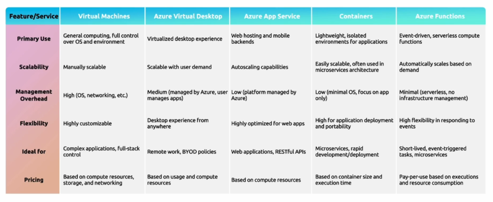

# 3.1 Compute Types

Azure offers wide variety of compute types depending on the infrastructural needs.

Compute types are **Flexible and on demand.**

These include:

- Virtual Machines
- App Services
- Container Instances
- Azure Kubernetes Services
- Azure Virtual Desktop
- Function Apps

[3.1.1 Virtual Machines and Virtual Machine Scale Sets](3%201%201%20Virtual%20Machines%20and%20Virtual%20Machine%20Scale%20S%2012c3e1d514fd80369040d79f805bdfea.md)

[3.1.2 Azure Virtual Desktops](3%201%202%20Azure%20Virtual%20Desktops%2012d3e1d514fd80e3bacbf5de3e374e8b.md)

[3.1.3 Azure App Services](3%201%203%20Azure%20App%20Services%201393e1d514fd80598d73ecd226c51092.md)

[3.1.4 Azure Container Services](3%201%204%20Azure%20Container%20Services%2015c3e1d514fd8087b84ff93a52301440.md)

[3.1.5 Azure Functions](3%201%205%20Azure%20Functions%2015d3e1d514fd80908feefba0e2decc8b.md)